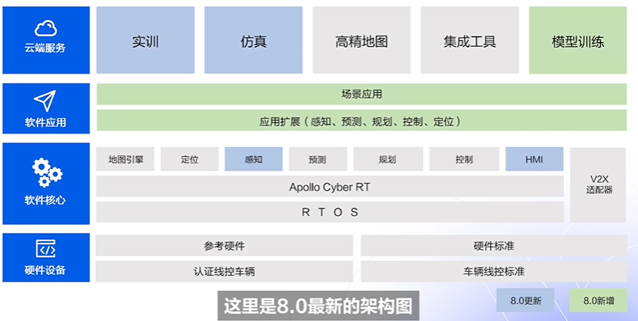
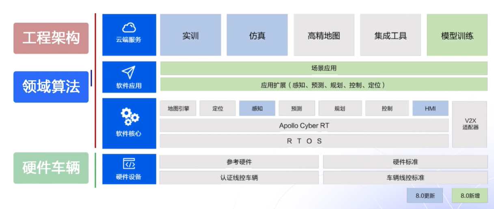
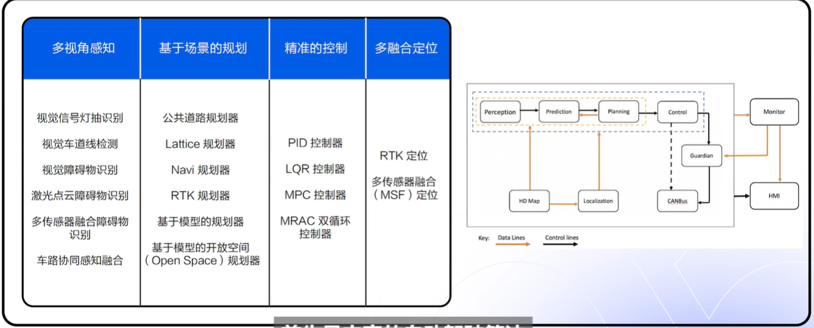

# 第一课：初识自动驾驶技术

环境感知 ，认知 ，驾驶策略规划 ， 控制和执行

## 人工智能算法

1. 感知算法：如何像人一样理解周边环境，准确识别出障碍物。
2. 决策规划算法：如何像人类老司机一样，做出安全且高效的决策控制指令。
3. 定位算法：定位算法如何提供实时的厘米及定位算法。

## Apollo 8.0开源算法详解

Apollo作为一个完整，开源的自动驾驶平台。

软件核心包括操作系统层 基于Ubuntu的操作系统，推荐是18.04。

Cyber RT 实时计算框架。

最上层是自动驾驶处理的逻辑模块，从静态感知相关的地图引擎 定位 到动态感知 预测 规划 控制等。

软件核心之上是软件应用层，为开发者提供了基于软件包管理的Apollo软件模块的使用方式和拓展方式。

软件应用层提供了各类场景应用代码层，如开放城市道路场景应用，教学上车演示D-KIT场景应用。

最上层是云服务，如仿真，模型训练 高精地图等等。

再回到前面自动驾驶的三类技术人才。

工程架构人才可以通过学习使用Cyber RT了解自动驾驶实时系统的设计，通过使用仿真 数据流水线等云服务，了解自动驾驶研发平台。

领域算法人才可以通过学习感知 定位 预测 规划 控制等逻辑模块的代码更深入了解各种算法设计与实现，Apollo提供了工具链 开发套件等产品能够帮助开发者快速闭环验证相关的技术模块。

## Apollo平台的核心能力

丰富的自动驾驶算法。

大家往往都比较关注自动驾驶中的算法，而忽视组织这些算法的通信框架。